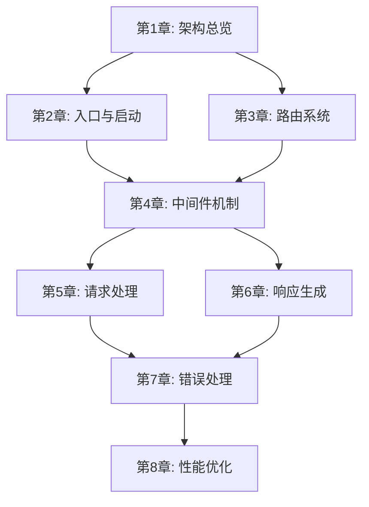

<!--
  Translation status:
  Source file : templates/outline.md
  Source commit: b016f9b
  Translated  : 2026-04-04
  Status      : up-to-date
-->

> **Languages**: [简体中文](../../../templates/outline.md) · **English** · [日本語](../../ja/templates/outline.md) · [繁體中文](../../zh-TW/templates/outline.md)

---

<!--
  ╔══════════════════════════════════════════════════════════════╗
  ║  Outline Template                                            ║
  ║                                                              ║
  ║  Purpose: Defines the chapter structure of the entire book,  ║
  ║           the core topic of each chapter, and dependencies   ║
  ║           between chapters. This is the first file completed ║
  ║           after a project is started; all other files        ║
  ║           (source-map, checkpoint, etc.) are built on it.    ║
  ║                                                              ║
  ║  Usage:                                                      ║
  ║  1. Determine the Part divisions and chapter list            ║
  ║  2. Fill in the core topic, covered source code, and         ║
  ║     prerequisites for each chapter                           ║
  ║  3. Once the outline is finalized, use it to initialize      ║
  ║     source-map.md and checkpoint.md                          ║
  ║  4. If the outline needs adjustment during writing,          ║
  ║     update related files in sync                             ║
  ║                                                              ║
  ║  Difficulty level guide:                                     ║
  ║  ⭐          Introductory — basic concepts                   ║
  ║  ⭐⭐        Beginner — simple implementation                ║
  ║  ⭐⭐⭐      Intermediate — requires some background         ║
  ║  ⭐⭐⭐⭐    Advanced — involves complex design              ║
  ║  ⭐⭐⭐⭐⭐  Expert — deep dive into underlying principles   ║
  ╚══════════════════════════════════════════════════════════════╝
-->

# {{书名}} Outline

## Book Information

| Attribute | Value |
|------|-----|
| Title | {{书名}} |
| Subtitle | {{副标题，可选}} |
| Source Project | {{项目名}} {{版本号}} |
| Target Audience | {{读者画像}} |
| Total Chapters | {{章节数}} |
| Estimated Total Length | {{总字数，如"6万~8万字"}} |

## Book Overview

<!-- 用3-5句话描述这本书要达成什么目标，读完后读者能获得什么 -->

> {{全书概述}}

## Reading Roadmap

<!-- 
可选：如果本书支持非线性阅读，在这里画出推荐的阅读路线。
如果必须线性阅读，可以删除此节。
-->

```
{{阅读路线图，可用文字或Mermaid流程图}}
```

<!-- 示例（Mermaid流程图）：

-->

---

## Part One: {{部分标题}}

> {{What problem does this part solve? What will readers understand after completing it? 2–3 sentences.}}

### Chapter 1: {{章标题}}

| Attribute | Value |
|------|-----|
| Core Topic | {{One sentence describing what this chapter covers}} |
| Source Code Covered | {{List of source code paths, e.g. `lib/express.js`, `lib/application.js`}} |
| Prerequisites | None |
| Difficulty | {{⭐~⭐⭐⭐⭐⭐}} |
| Estimated Length | {{字数}} |
| Key Outcome | {{What questions can readers answer after this chapter}} |

#### Section-Level Outline

<!-- 列出本章的H2级别节标题和每节要点 -->

1. **{{节标题1}}**
   - {{要点A}}
   - {{要点B}}
2. **{{节标题2}}**
   - {{要点A}}
   - {{要点B}}
3. **{{节标题3}}**
   - {{要点A}}

<!-- 示例：
1. **Express是什么（不是什么）**
   - Express的定位：最小化、灵活的Web框架
   - Express不是什么：不是全栈框架、不是ORM
2. **项目结构一览**
   - 目录结构解析
   - 核心文件概览（6个文件撑起整个框架）
3. **从package.json开始**
   - 依赖分析：Express只依赖30个包
   - 入口文件追踪
4. **第一行代码到启动**
   - createApplication()工厂函数
   - mixin模式：把方法混入app对象
-->

---

### Chapter 2: {{章标题}}

| Attribute | Value |
|------|-----|
| Core Topic | {{One sentence description}} |
| Source Code Covered | {{List of source code paths}} |
| Prerequisites | Chapter 1 |
| Difficulty | {{⭐~⭐⭐⭐⭐⭐}} |
| Estimated Length | {{字数}} |
| Key Outcome | {{What questions can readers answer after this chapter}} |

#### Section-Level Outline

1. **{{节标题1}}**
   - {{要点}}
2. **{{节标题2}}**
   - {{要点}}

---

### Chapter 3: {{章标题}}

| Attribute | Value |
|------|-----|
| Core Topic | {{One sentence description}} |
| Source Code Covered | {{List of source code paths}} |
| Prerequisites | {{前置章节}} |
| Difficulty | {{⭐~⭐⭐⭐⭐⭐}} |
| Estimated Length | {{字数}} |
| Key Outcome | {{What questions can readers answer after this chapter}} |

#### Section-Level Outline

1. **{{节标题1}}**
   - {{要点}}

---

## Part Two: {{部分标题}}

> {{What problem does this part solve? 2–3 sentences.}}

### Chapter 4: {{章标题}}

| Attribute | Value |
|------|-----|
| Core Topic | {{One sentence description}} |
| Source Code Covered | {{List of source code paths}} |
| Prerequisites | {{前置章节}} |
| Difficulty | {{⭐~⭐⭐⭐⭐⭐}} |
| Estimated Length | {{字数}} |
| Key Outcome | {{关键产出}} |

#### Section-Level Outline

1. **{{节标题1}}**
   - {{要点}}

---

### Chapter 5: {{章标题}}

| Attribute | Value |
|------|-----|
| Core Topic | {{One sentence description}} |
| Source Code Covered | {{List of source code paths}} |
| Prerequisites | {{前置章节}} |
| Difficulty | {{⭐~⭐⭐⭐⭐⭐}} |
| Estimated Length | {{字数}} |
| Key Outcome | {{关键产出}} |

#### Section-Level Outline

1. **{{节标题1}}**
   - {{要点}}

---

## Part Three: {{部分标题}}

> {{What problem does this part solve? 2–3 sentences.}}

### Chapter 6: {{章标题}}

| Attribute | Value |
|------|-----|
| Core Topic | {{One sentence description}} |
| Source Code Covered | {{List of source code paths}} |
| Prerequisites | {{前置章节}} |
| Difficulty | {{⭐~⭐⭐⭐⭐⭐}} |
| Estimated Length | {{字数}} |
| Key Outcome | {{关键产出}} |

#### Section-Level Outline

1. **{{节标题1}}**
   - {{要点}}

---

### Chapter 7: {{章标题}}

| Attribute | Value |
|------|-----|
| Core Topic | {{One sentence description}} |
| Source Code Covered | {{List of source code paths}} |
| Prerequisites | {{前置章节}} |
| Difficulty | {{⭐~⭐⭐⭐⭐⭐}} |
| Estimated Length | {{字数}} |
| Key Outcome | {{关键产出}} |

#### Section-Level Outline

1. **{{节标题1}}**
   - {{要点}}

---

### Chapter 8: {{章标题}}

| Attribute | Value |
|------|-----|
| Core Topic | {{One sentence description}} |
| Source Code Covered | {{List of source code paths}} |
| Prerequisites | {{前置章节}} |
| Difficulty | {{⭐~⭐⭐⭐⭐⭐}} |
| Estimated Length | {{字数}} |
| Key Outcome | {{关键产出}} |

#### Section-Level Outline

1. **{{节标题1}}**
   - {{要点}}

---

<!-- 根据实际章节数继续添加章节... -->

## Appendices (Optional)

### Appendix A: {{标题}}
> {{Content description, e.g. "Recommended reading resources list"}}

### Appendix B: {{标题}}
> {{Content description, e.g. "Debugging tips quick reference"}}

## Chapter Dependency Overview

<!--
用列表或图形展示章节之间的依赖关系，帮助确定写作顺序和批次划分。
-->

| Chapter | Depends On | Depended On By |
|------|------|--------|
| Chapter 1 | — | Chapters 2–{{N}} |
| Chapter 2 | Chapter 1 | {{列表}} |
| Chapter 3 | {{列表}} | {{列表}} |
| Chapter 4 | {{列表}} | {{列表}} |
| Chapter 5 | {{列表}} | {{列表}} |
| Chapter 6 | {{列表}} | {{列表}} |
| Chapter 7 | {{列表}} | {{列表}} |
| Chapter 8 | {{列表}} | — |

## Revision History

| Date | Change | Reason |
|------|----------|------|
| {{YYYY-MM-DD}} | Initial outline created | — |
