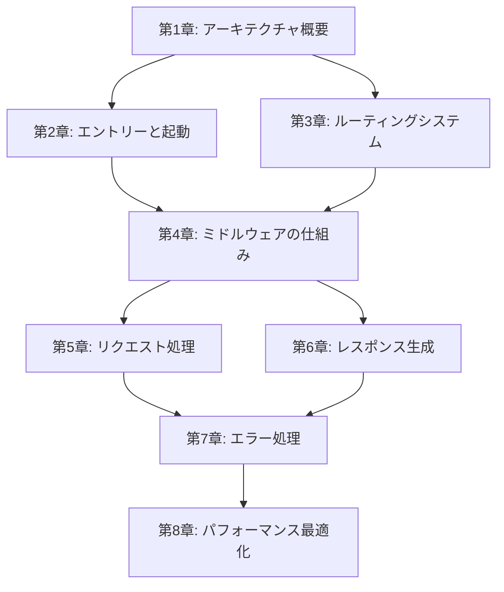

<!--
  Translation status:
  Source file : templates/outline.md
  Source commit: 7685751
  Translated  : 2026-04-04
  Status      : up-to-date
-->

> **言語 / Language**: [简体中文](../../../templates/outline.md) · [English](../../en/templates/outline.md) · **日本語** · [繁體中文](../../zh-TW/templates/outline.md)

---

<!--
  ╔══════════════════════════════════════════════════════════════╗
  ║  アウトラインテンプレート (Outline Template)                 ║
  ║                                                              ║
  ║  用途：全書の章構成、各章のコアテーマ、依存関係を定義します。 ║
  ║        プロジェクト開始後に最初に完成させるファイルであり、  ║
  ║        他のファイル（source-map, checkpoint 等）はすべて     ║
  ║        本ファイルを基礎とします。                            ║
  ║                                                              ║
  ║  使用方法：                                                  ║
  ║  1. 全書のパート分けと章リストを確定する                     ║
  ║  2. 各章にコアテーマ、対象ソースコード、前提条件などを記入   ║
  ║  3. アウトライン確定後、source-map.md と checkpoint.md を    ║
  ║     初期化する                                               ║
  ║  4. 執筆中にアウトラインを調整する場合は関連ファイルも同期更新 ║
  ║                                                              ║
  ║  難易度の説明：                                              ║
  ║  ⭐          入門レベル、基礎概念                            ║
  ║  ⭐⭐        初級、シンプルな実装                            ║
  ║  ⭐⭐⭐      中級、ある程度の基礎が必要                      ║
  ║  ⭐⭐⭐⭐    上級、複雑な設計を含む                          ║
  ║  ⭐⭐⭐⭐⭐  エキスパート、深い底層原理まで踏み込む           ║
  ╚══════════════════════════════════════════════════════════════╝
-->

# {{書名}} アウトライン

## 書籍情報

| 属性 | 値 |
|------|-----|
| 書名 | {{書名}} |
| 副タイトル | {{副タイトル（任意）}} |
| ソースプロジェクト | {{プロジェクト名}} {{バージョン番号}} |
| 対象読者 | {{読者像}} |
| 総章数 | {{章数}} |
| 推定総文字数 | {{総文字数、例：「6万〜8万字」}} |

## 全書の概要

<!-- 3〜5文でこの本の目標と読後に読者が得られるものを説明してください -->

> {{全書の概要}}

## 読書ロードマップ

<!-- 
オプション：非線形の読み方をサポートする場合は、ここに推奨の読書ルートを示します。
必ず線形に読む場合は、このセクションを削除してください。
-->

```
{{読書ロードマップ、テキストまたはMermaidフローチャートで表現可能}}
```

<!-- 例（Mermaidフローチャート）：

-->

---

## 第一部: {{パートタイトル}}

> {{このパートが解決する問題と、読了後に読者が理解できること（2〜3文）}}

### 第1章: {{章タイトル}}

| 属性 | 値 |
|------|-----|
| コアテーマ | {{この章が何を説明するかを一文で}} |
| 対象ソースコード | {{ソースコードパスのリスト、例：`lib/express.js`, `lib/application.js`}} |
| 前提条件 | なし |
| 難易度 | {{⭐〜⭐⭐⭐⭐⭐}} |
| 推定文字数 | {{文字数}} |
| 主要な学習成果 | {{この章を読み終えた後、読者が答えられる問い}} |

#### 節レベルのアウトライン

<!-- この章のH2レベルの節タイトルと各節の要点を列挙してください -->

1. **{{節タイトル1}}**
   - {{要点A}}
   - {{要点B}}
2. **{{節タイトル2}}**
   - {{要点A}}
   - {{要点B}}
3. **{{節タイトル3}}**
   - {{要点A}}

<!-- 例：
1. **Express とは何か（何でないか）**
   - Express の位置づけ：最小限で柔軟な Web フレームワーク
   - Express でないもの：フルスタックフレームワークではない、ORM でもない
2. **プロジェクト構造一覧**
   - ディレクトリ構造の解析
   - コアファイルの概要（6つのファイルがフレームワーク全体を支える）
3. **package.json から始める**
   - 依存関係の分析：Express は 30 個のパッケージにしか依存しない
   - エントリーファイルの追跡
4. **最初の1行から起動まで**
   - createApplication() ファクトリー関数
   - mixin パターン：メソッドを app オブジェクトに混入する
-->

---

### 第2章: {{章タイトル}}

| 属性 | 値 |
|------|-----|
| コアテーマ | {{一文で説明}} |
| 対象ソースコード | {{ソースコードパスのリスト}} |
| 前提条件 | 第1章 |
| 難易度 | {{⭐〜⭐⭐⭐⭐⭐}} |
| 推定文字数 | {{文字数}} |
| 主要な学習成果 | {{この章を読み終えた後、読者が答えられる問い}} |

#### 節レベルのアウトライン

1. **{{節タイトル1}}**
   - {{要点}}
2. **{{節タイトル2}}**
   - {{要点}}

---

### 第3章: {{章タイトル}}

| 属性 | 値 |
|------|-----|
| コアテーマ | {{一文で説明}} |
| 対象ソースコード | {{ソースコードパスのリスト}} |
| 前提条件 | {{前提章}} |
| 難易度 | {{⭐〜⭐⭐⭐⭐⭐}} |
| 推定文字数 | {{文字数}} |
| 主要な学習成果 | {{この章を読み終えた後、読者が答えられる問い}} |

#### 節レベルのアウトライン

1. **{{節タイトル1}}**
   - {{要点}}

---

## 第二部: {{パートタイトル}}

> {{このパートが解決する問題（2〜3文）}}

### 第4章: {{章タイトル}}

| 属性 | 値 |
|------|-----|
| コアテーマ | {{一文で説明}} |
| 対象ソースコード | {{ソースコードパスのリスト}} |
| 前提条件 | {{前提章}} |
| 難易度 | {{⭐〜⭐⭐⭐⭐⭐}} |
| 推定文字数 | {{文字数}} |
| 主要な学習成果 | {{主要な学習成果}} |

#### 節レベルのアウトライン

1. **{{節タイトル1}}**
   - {{要点}}

---

### 第5章: {{章タイトル}}

| 属性 | 値 |
|------|-----|
| コアテーマ | {{一文で説明}} |
| 対象ソースコード | {{ソースコードパスのリスト}} |
| 前提条件 | {{前提章}} |
| 難易度 | {{⭐〜⭐⭐⭐⭐⭐}} |
| 推定文字数 | {{文字数}} |
| 主要な学習成果 | {{主要な学習成果}} |

#### 節レベルのアウトライン

1. **{{節タイトル1}}**
   - {{要点}}

---

## 第三部: {{パートタイトル}}

> {{このパートが解決する問題（2〜3文）}}

### 第6章: {{章タイトル}}

| 属性 | 値 |
|------|-----|
| コアテーマ | {{一文で説明}} |
| 対象ソースコード | {{ソースコードパスのリスト}} |
| 前提条件 | {{前提章}} |
| 難易度 | {{⭐〜⭐⭐⭐⭐⭐}} |
| 推定文字数 | {{文字数}} |
| 主要な学習成果 | {{主要な学習成果}} |

#### 節レベルのアウトライン

1. **{{節タイトル1}}**
   - {{要点}}

---

### 第7章: {{章タイトル}}

| 属性 | 値 |
|------|-----|
| コアテーマ | {{一文で説明}} |
| 対象ソースコード | {{ソースコードパスのリスト}} |
| 前提条件 | {{前提章}} |
| 難易度 | {{⭐〜⭐⭐⭐⭐⭐}} |
| 推定文字数 | {{文字数}} |
| 主要な学習成果 | {{主要な学習成果}} |

#### 節レベルのアウトライン

1. **{{節タイトル1}}**
   - {{要点}}

---

### 第8章: {{章タイトル}}

| 属性 | 値 |
|------|-----|
| コアテーマ | {{一文で説明}} |
| 対象ソースコード | {{ソースコードパスのリスト}} |
| 前提条件 | {{前提章}} |
| 難易度 | {{⭐〜⭐⭐⭐⭐⭐}} |
| 推定文字数 | {{文字数}} |
| 主要な学習成果 | {{主要な学習成果}} |

#### 節レベルのアウトライン

1. **{{節タイトル1}}**
   - {{要点}}

---

<!-- 実際の章数に応じて章を追加してください... -->

## 付録（任意）

### 付録A: {{タイトル}}
> {{内容の説明、例：「推奨読書リスト」}}

### 付録B: {{タイトル}}
> {{内容の説明、例：「デバッグ技術クイックリファレンス」}}

## 章の依存関係総覧

<!--
章の依存関係をリストまたは図で示し、執筆順序とバッチ分けを確定するのに役立てます。
-->

| 章 | 依存 | 被依存 |
|------|------|--------|
| 第1章 | — | 第2〜{{N}}章 |
| 第2章 | 第1章 | {{リスト}} |
| 第3章 | {{リスト}} | {{リスト}} |
| 第4章 | {{リスト}} | {{リスト}} |
| 第5章 | {{リスト}} | {{リスト}} |
| 第6章 | {{リスト}} | {{リスト}} |
| 第7章 | {{リスト}} | {{リスト}} |
| 第8章 | {{リスト}} | — |

## 改訂履歴

| 日付 | 変更内容 | 理由 |
|------|----------|------|
| {{YYYY-MM-DD}} | 初期アウトライン作成 | — |
