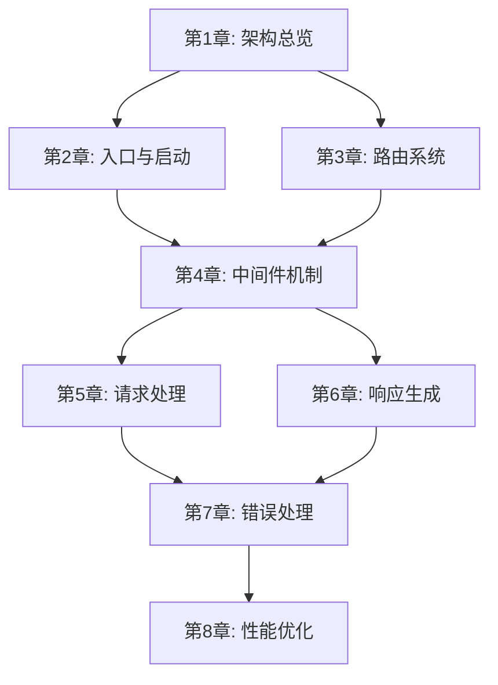

<!--
  Translation status:
  Source file : templates/outline.md
  Source commit: 7685751
  Translated  : 2026-04-04
  Status      : up-to-date
-->

> **語言 / Language**: [简体中文](../../../templates/outline.md) · [English](../../en/templates/outline.md) · [日本語](../../ja/templates/outline.md) · **繁體中文**

---

<!--
  ╔══════════════════════════════════════════════════════════════╗
  ║  大綱模板 (Outline Template)                                 ║
  ║                                                              ║
  ║  用途：定義全書的章節結構、每章的核心主題和依賴關係。          ║
  ║        這是項目啓動後最先完成的文件，其他文件（source-map,     ║
  ║        checkpoint 等）都以本文件爲基礎。                       ║
  ║                                                              ║
  ║  使用方式：                                                   ║
  ║  1. 確定全書的部分(Part)劃分和章節列表                        ║
  ║  2. 爲每章填寫核心主題、覆蓋源碼、前置依賴等                  ║
  ║  3. 大綱確定後，據此初始化 source-map.md 和 checkpoint.md     ║
  ║  4. 寫作過程中如需調整大綱，同步更新相關文件                  ║
  ║                                                              ║
  ║  難度等級說明：                                               ║
  ║  ⭐          入門級，基礎概念                                 ║
  ║  ⭐⭐        初級，簡單實現                                   ║
  ║  ⭐⭐⭐      中級，需要一定基礎                               ║
  ║  ⭐⭐⭐⭐    高級，涉及複雜設計                               ║
  ║  ⭐⭐⭐⭐⭐  專家級，深入底層原理                             ║
  ╚══════════════════════════════════════════════════════════════╝
-->

# {{書名}} 大綱

## 書籍信息

| 屬性 | 值 |
|------|-----|
| 書名 | {{書名}} |
| 副標題 | {{副標題，可選}} |
| 源碼項目 | {{項目名}} {{版本號}} |
| 目標讀者 | {{讀者畫像}} |
| 總章數 | {{章節數}} |
| 預計總字數 | {{總字數，如"6萬~8萬字"}} |

## 全書概述

<!-- 用3-5句話描述這本書要達成什麼目標，讀完後讀者能獲得什麼 -->

> {{全書概述}}

## 閱讀路線圖

<!-- 
可選：如果本書支持非線性閱讀，在這裏畫出推薦的閱讀路線。
如果必須線性閱讀，可以刪除此節。
-->

```
{{阅读路线图，可用文字或Mermaid流程图}}
```

<!-- 示例（Mermaid流程圖）：

-->

---

## 第一部分: {{部分標題}}

> {{這部分要解決什麼問題？讀完這部分讀者能理解什麼？2~3句話}}

### 第1章: {{章標題}}

| 屬性 | 值 |
|------|-----|
| 核心主題 | {{一句話描述本章要講什麼}} |
| 覆蓋源碼 | {{源碼路徑列表，如 `lib/express.js`, `lib/application.js`}} |
| 前置依賴 | 無 |
| 難度 | {{⭐~⭐⭐⭐⭐⭐}} |
| 預計字數 | {{字數}} |
| 關鍵產出 | {{讀完本章，讀者能回答什麼問題}} |

#### 節級大綱

<!-- 列出本章的H2級別節標題和每節要點 -->

1. **{{節標題1}}**
   - {{要點A}}
   - {{要點B}}
2. **{{節標題2}}**
   - {{要點A}}
   - {{要點B}}
3. **{{節標題3}}**
   - {{要點A}}

<!-- 示例：
1. **Express是什麼（不是什麼）**
   - Express的定位：最小化、靈活的Web框架
   - Express不是什麼：不是全棧框架、不是ORM
2. **項目結構一覽**
   - 目錄結構解析
   - 核心文件概覽（6個文件撐起整個框架）
3. **從package.json開始**
   - 依賴分析：Express只依賴30個包
   - 入口文件追蹤
4. **第一行代碼到啓動**
   - createApplication()工廠函數
   - mixin模式：把方法混入app對象
-->

---

### 第2章: {{章標題}}

| 屬性 | 值 |
|------|-----|
| 核心主題 | {{一句話描述}} |
| 覆蓋源碼 | {{源碼路徑列表}} |
| 前置依賴 | 第1章 |
| 難度 | {{⭐~⭐⭐⭐⭐⭐}} |
| 預計字數 | {{字數}} |
| 關鍵產出 | {{讀完本章，讀者能回答什麼問題}} |

#### 節級大綱

1. **{{節標題1}}**
   - {{要點}}
2. **{{節標題2}}**
   - {{要點}}

---

### 第3章: {{章標題}}

| 屬性 | 值 |
|------|-----|
| 核心主題 | {{一句話描述}} |
| 覆蓋源碼 | {{源碼路徑列表}} |
| 前置依賴 | {{前置章節}} |
| 難度 | {{⭐~⭐⭐⭐⭐⭐}} |
| 預計字數 | {{字數}} |
| 關鍵產出 | {{讀完本章，讀者能回答什麼問題}} |

#### 節級大綱

1. **{{節標題1}}**
   - {{要點}}

---

## 第二部分: {{部分標題}}

> {{這部分要解決什麼問題？2~3句話}}

### 第4章: {{章標題}}

| 屬性 | 值 |
|------|-----|
| 核心主題 | {{一句話描述}} |
| 覆蓋源碼 | {{源碼路徑列表}} |
| 前置依賴 | {{前置章節}} |
| 難度 | {{⭐~⭐⭐⭐⭐⭐}} |
| 預計字數 | {{字數}} |
| 關鍵產出 | {{關鍵產出}} |

#### 節級大綱

1. **{{節標題1}}**
   - {{要點}}

---

### 第5章: {{章標題}}

| 屬性 | 值 |
|------|-----|
| 核心主題 | {{一句話描述}} |
| 覆蓋源碼 | {{源碼路徑列表}} |
| 前置依賴 | {{前置章節}} |
| 難度 | {{⭐~⭐⭐⭐⭐⭐}} |
| 預計字數 | {{字數}} |
| 關鍵產出 | {{關鍵產出}} |

#### 節級大綱

1. **{{節標題1}}**
   - {{要點}}

---

## 第三部分: {{部分標題}}

> {{這部分要解決什麼問題？2~3句話}}

### 第6章: {{章標題}}

| 屬性 | 值 |
|------|-----|
| 核心主題 | {{一句話描述}} |
| 覆蓋源碼 | {{源碼路徑列表}} |
| 前置依賴 | {{前置章節}} |
| 難度 | {{⭐~⭐⭐⭐⭐⭐}} |
| 預計字數 | {{字數}} |
| 關鍵產出 | {{關鍵產出}} |

#### 節級大綱

1. **{{節標題1}}**
   - {{要點}}

---

### 第7章: {{章標題}}

| 屬性 | 值 |
|------|-----|
| 核心主題 | {{一句話描述}} |
| 覆蓋源碼 | {{源碼路徑列表}} |
| 前置依賴 | {{前置章節}} |
| 難度 | {{⭐~⭐⭐⭐⭐⭐}} |
| 預計字數 | {{字數}} |
| 關鍵產出 | {{關鍵產出}} |

#### 節級大綱

1. **{{節標題1}}**
   - {{要點}}

---

### 第8章: {{章標題}}

| 屬性 | 值 |
|------|-----|
| 核心主題 | {{一句話描述}} |
| 覆蓋源碼 | {{源碼路徑列表}} |
| 前置依賴 | {{前置章節}} |
| 難度 | {{⭐~⭐⭐⭐⭐⭐}} |
| 預計字數 | {{字數}} |
| 關鍵產出 | {{關鍵產出}} |

#### 節級大綱

1. **{{節標題1}}**
   - {{要點}}

---

<!-- 根據實際章節數繼續添加章節... -->

## 附錄（可選）

### 附錄A: {{標題}}
> {{內容說明，如"推薦閱讀資源列表"}}

### 附錄B: {{標題}}
> {{內容說明，如"調試技巧速查表"}}

## 章節依賴關係總覽

<!--
用列表或圖形展示章節之間的依賴關係，幫助確定寫作順序和批次劃分。
-->

| 章節 | 依賴 | 被依賴 |
|------|------|--------|
| 第1章 | — | 第2~{{N}}章 |
| 第2章 | 第1章 | {{列表}} |
| 第3章 | {{列表}} | {{列表}} |
| 第4章 | {{列表}} | {{列表}} |
| 第5章 | {{列表}} | {{列表}} |
| 第6章 | {{列表}} | {{列表}} |
| 第7章 | {{列表}} | {{列表}} |
| 第8章 | {{列表}} | — |

## 修訂記錄

| 日期 | 修改內容 | 原因 |
|------|----------|------|
| {{YYYY-MM-DD}} | 初始大綱創建 | — |
