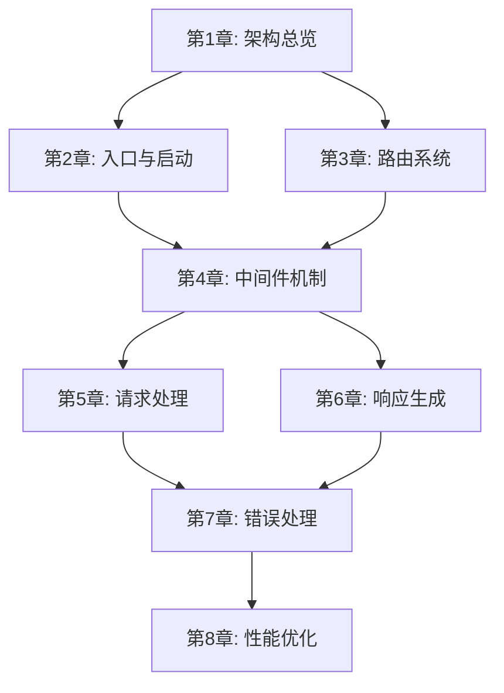

<!--
  ╔══════════════════════════════════════════════════════════════╗
  ║  大纲模板 (Outline Template)                                 ║
  ║                                                              ║
  ║  用途：定义全书的章节结构、每章的核心主题和依赖关系。          ║
  ║        这是项目启动后最先完成的文件，其他文件（source-map,     ║
  ║        checkpoint 等）都以本文件为基础。                       ║
  ║                                                              ║
  ║  使用方式：                                                   ║
  ║  1. 确定全书的部分(Part)划分和章节列表                        ║
  ║  2. 为每章填写核心主题、覆盖源码、前置依赖等                  ║
  ║  3. 大纲确定后，据此初始化 source-map.md 和 checkpoint.md     ║
  ║  4. 写作过程中如需调整大纲，同步更新相关文件                  ║
  ║                                                              ║
  ║  难度等级说明：                                               ║
  ║  ⭐          入门级，基础概念                                 ║
  ║  ⭐⭐        初级，简单实现                                   ║
  ║  ⭐⭐⭐      中级，需要一定基础                               ║
  ║  ⭐⭐⭐⭐    高级，涉及复杂设计                               ║
  ║  ⭐⭐⭐⭐⭐  专家级，深入底层原理                             ║
  ╚══════════════════════════════════════════════════════════════╝
-->

# {{书名}} 大纲

## 书籍信息

| 属性 | 值 |
|------|-----|
| 书名 | {{书名}} |
| 副标题 | {{副标题，可选}} |
| 源码项目 | {{项目名}} {{版本号}} |
| 目标读者 | {{读者画像}} |
| 总章数 | {{章节数}} |
| 预计总字数 | {{总字数，如"6万~8万字"}} |

## 全书概述

<!-- 用3-5句话描述这本书要达成什么目标，读完后读者能获得什么 -->

> {{全书概述}}

## 阅读路线图

<!-- 
可选：如果本书支持非线性阅读，在这里画出推荐的阅读路线。
如果必须线性阅读，可以删除此节。
-->

```
{{阅读路线图，可用文字或Mermaid流程图}}
```

<!-- 示例（Mermaid流程图）：

-->

---

## 第一部分: {{部分标题}}

> {{这部分要解决什么问题？读完这部分读者能理解什么？2~3句话}}

### 第1章: {{章标题}}

| 属性 | 值 |
|------|-----|
| 核心主题 | {{一句话描述本章要讲什么}} |
| 覆盖源码 | {{源码路径列表，如 `lib/express.js`, `lib/application.js`}} |
| 前置依赖 | 无 |
| 难度 | {{⭐~⭐⭐⭐⭐⭐}} |
| 预计字数 | {{字数}} |
| 关键产出 | {{读完本章，读者能回答什么问题}} |

#### 节级大纲

<!-- 列出本章的H2级别节标题和每节要点 -->

1. **{{节标题1}}**
   - {{要点A}}
   - {{要点B}}
2. **{{节标题2}}**
   - {{要点A}}
   - {{要点B}}
3. **{{节标题3}}**
   - {{要点A}}

<!-- 示例：
1. **Express是什么（不是什么）**
   - Express的定位：最小化、灵活的Web框架
   - Express不是什么：不是全栈框架、不是ORM
2. **项目结构一览**
   - 目录结构解析
   - 核心文件概览（6个文件撑起整个框架）
3. **从package.json开始**
   - 依赖分析：Express只依赖30个包
   - 入口文件追踪
4. **第一行代码到启动**
   - createApplication()工厂函数
   - mixin模式：把方法混入app对象
-->

---

### 第2章: {{章标题}}

| 属性 | 值 |
|------|-----|
| 核心主题 | {{一句话描述}} |
| 覆盖源码 | {{源码路径列表}} |
| 前置依赖 | 第1章 |
| 难度 | {{⭐~⭐⭐⭐⭐⭐}} |
| 预计字数 | {{字数}} |
| 关键产出 | {{读完本章，读者能回答什么问题}} |

#### 节级大纲

1. **{{节标题1}}**
   - {{要点}}
2. **{{节标题2}}**
   - {{要点}}

---

### 第3章: {{章标题}}

| 属性 | 值 |
|------|-----|
| 核心主题 | {{一句话描述}} |
| 覆盖源码 | {{源码路径列表}} |
| 前置依赖 | {{前置章节}} |
| 难度 | {{⭐~⭐⭐⭐⭐⭐}} |
| 预计字数 | {{字数}} |
| 关键产出 | {{读完本章，读者能回答什么问题}} |

#### 节级大纲

1. **{{节标题1}}**
   - {{要点}}

---

## 第二部分: {{部分标题}}

> {{这部分要解决什么问题？2~3句话}}

### 第4章: {{章标题}}

| 属性 | 值 |
|------|-----|
| 核心主题 | {{一句话描述}} |
| 覆盖源码 | {{源码路径列表}} |
| 前置依赖 | {{前置章节}} |
| 难度 | {{⭐~⭐⭐⭐⭐⭐}} |
| 预计字数 | {{字数}} |
| 关键产出 | {{关键产出}} |

#### 节级大纲

1. **{{节标题1}}**
   - {{要点}}

---

### 第5章: {{章标题}}

| 属性 | 值 |
|------|-----|
| 核心主题 | {{一句话描述}} |
| 覆盖源码 | {{源码路径列表}} |
| 前置依赖 | {{前置章节}} |
| 难度 | {{⭐~⭐⭐⭐⭐⭐}} |
| 预计字数 | {{字数}} |
| 关键产出 | {{关键产出}} |

#### 节级大纲

1. **{{节标题1}}**
   - {{要点}}

---

## 第三部分: {{部分标题}}

> {{这部分要解决什么问题？2~3句话}}

### 第6章: {{章标题}}

| 属性 | 值 |
|------|-----|
| 核心主题 | {{一句话描述}} |
| 覆盖源码 | {{源码路径列表}} |
| 前置依赖 | {{前置章节}} |
| 难度 | {{⭐~⭐⭐⭐⭐⭐}} |
| 预计字数 | {{字数}} |
| 关键产出 | {{关键产出}} |

#### 节级大纲

1. **{{节标题1}}**
   - {{要点}}

---

### 第7章: {{章标题}}

| 属性 | 值 |
|------|-----|
| 核心主题 | {{一句话描述}} |
| 覆盖源码 | {{源码路径列表}} |
| 前置依赖 | {{前置章节}} |
| 难度 | {{⭐~⭐⭐⭐⭐⭐}} |
| 预计字数 | {{字数}} |
| 关键产出 | {{关键产出}} |

#### 节级大纲

1. **{{节标题1}}**
   - {{要点}}

---

### 第8章: {{章标题}}

| 属性 | 值 |
|------|-----|
| 核心主题 | {{一句话描述}} |
| 覆盖源码 | {{源码路径列表}} |
| 前置依赖 | {{前置章节}} |
| 难度 | {{⭐~⭐⭐⭐⭐⭐}} |
| 预计字数 | {{字数}} |
| 关键产出 | {{关键产出}} |

#### 节级大纲

1. **{{节标题1}}**
   - {{要点}}

---

<!-- 根据实际章节数继续添加章节... -->

## 附录（可选）

### 附录A: {{标题}}
> {{内容说明，如"推荐阅读资源列表"}}

### 附录B: {{标题}}
> {{内容说明，如"调试技巧速查表"}}

## 章节依赖关系总览

<!--
用列表或图形展示章节之间的依赖关系，帮助确定写作顺序和批次划分。
-->

| 章节 | 依赖 | 被依赖 |
|------|------|--------|
| 第1章 | — | 第2~{{N}}章 |
| 第2章 | 第1章 | {{列表}} |
| 第3章 | {{列表}} | {{列表}} |
| 第4章 | {{列表}} | {{列表}} |
| 第5章 | {{列表}} | {{列表}} |
| 第6章 | {{列表}} | {{列表}} |
| 第7章 | {{列表}} | {{列表}} |
| 第8章 | {{列表}} | — |

## 修订记录

| 日期 | 修改内容 | 原因 |
|------|----------|------|
| {{YYYY-MM-DD}} | 初始大纲创建 | — |
